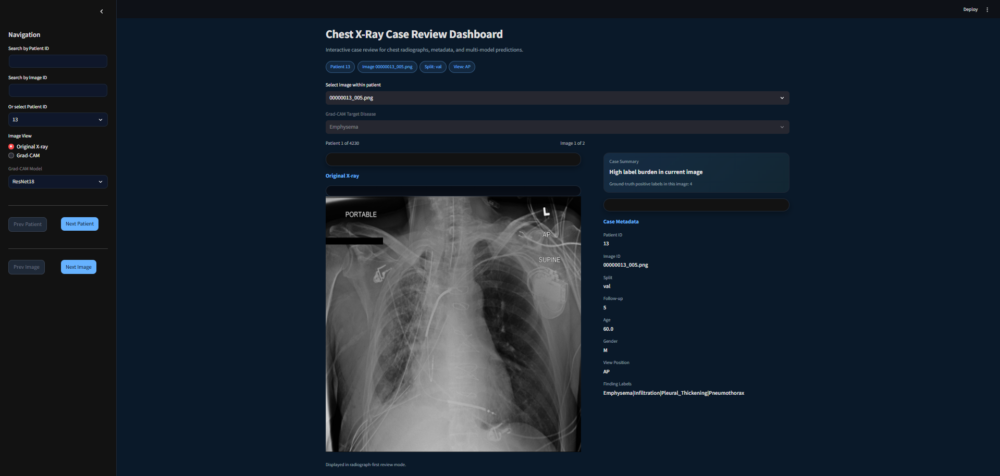
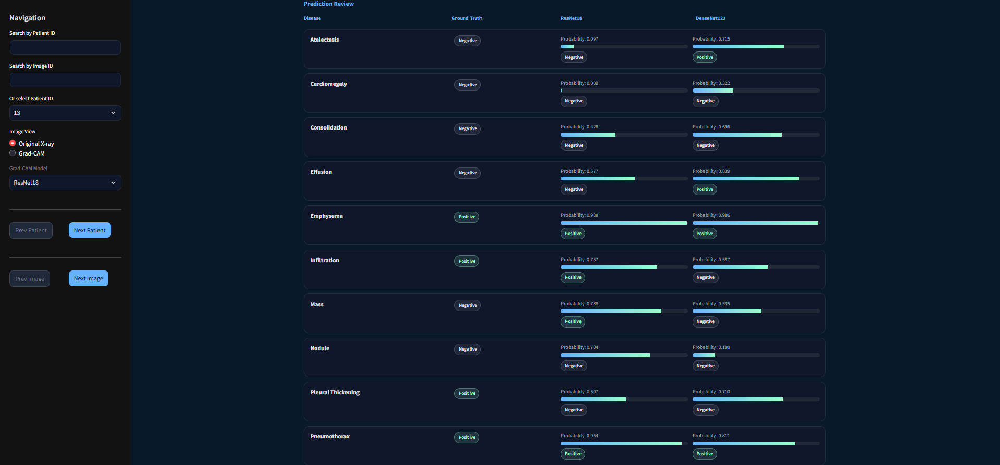
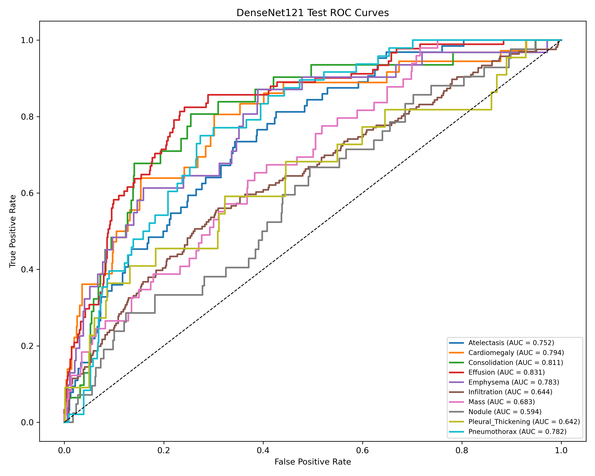
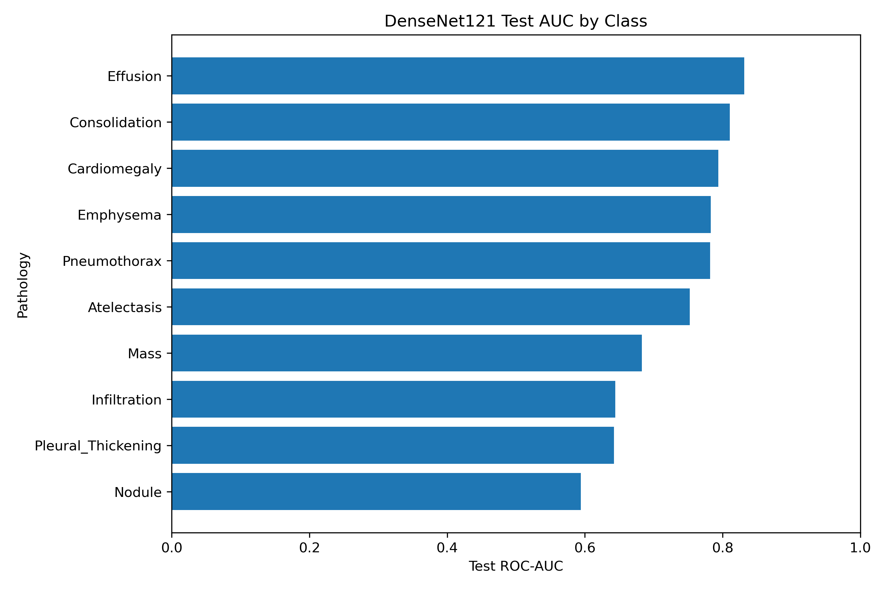
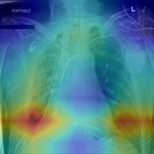

# NIH ChestX-ray14 Thoracic Radiograph Analysis with Dashboard Visualizer

## Quick Start
Clone the repository

git clone [https://github.com/rajos29/chest-xray-project.git](https://github.com/rajos29/NIH-ChestX-ray14-Thoracic-Radiograph-Analysis-with-Dashboard-Visualizer.git)

cd chest-xray-project

pip install -r requirements.txt

Launch the dashboard: streamlit run dashboard/app.py





Folder Structure:

dashboard/        Streamlit interface for model inspection

scripts/          dataset preparation, training, and evaluation

manifest/         prediction and case review manifests

results/          ROC curves and evaluation outputs

labels/           metadata and label processing

README.md         project documentation

requirements.txt  Python dependencies

---
## Overview

This project implements an end-to-end deep learning workflow for **multi-label thoracic disease classification from chest radiographs** and an **interactive case review dashboard** for inspecting predictions, metadata, and Grad-CAM visual explanations.

The project goes beyond a simple model-training exercise. In addition to training and evaluating convolutional neural networks, it includes:

- structured dataset and metadata handling
- patient-level leakage prevention
- multi-label prediction export pipelines
- ROC/AUC-based model evaluation
- interactive patient/image navigation
- model interpretability through Grad-CAM

The resulting dashboard supports image-level and patient-level review of:

- original X-rays
- ground-truth labels
- model prediction probabilities
- model-predicted classes
- Grad-CAM heatmap overlays

---
## Motivation

Chest X-rays are one of the most common imaging modalities in medicine, and many thoracic conditions can appear simultaneously in a single radiograph. This makes the task naturally **multi-label**, not single-class.

This project focuses on building a reproducible workflow for:

1. training multi-label chest X-ray classifiers
2. evaluating clinically relevant model behavior
3. organizing predictions at the patient/image level
4. creating a usable model inspection interface

The goal is not to present a clinical product, but rather a **research-oriented machine learning and visualization pipeline for medical imaging analysis**.

---
## Data Source and Attribution

This project uses metadata and image data derived from the **NIH ChestX-ray dataset**.

### Original Dataset

**ChestX-ray8 / ChestX-ray14**  
A large-scale public chest radiograph dataset introduced by the National Institutes of Health Clinical Center.

*Please know the NIH ChestX-ray dataset is not included in this repository.*

Due to licensing and size constraints, users must download the dataset directly from the official source:

https://nihcc.app.box.com/v/ChestXray-NIHCC

After downloading, place the images in the following directory structure:

images/
    images_001/
    images_002/
    ...
    images_012/

Metadata files (e.g., Data_Entry_2017.csv) should be placed in:

labels/

The dataset preparation scripts in `scripts/dataset/` will process the metadata and generate the training manifest.

## Preparing the Dataset

After downloading the dataset:

python scripts/dataset/create_manifest_v2.py

### Primary Reference

**Wang, Xiaosong, et al.**  
*ChestX-ray8: Hospital-Scale Chest X-ray Database and Benchmarks on Weakly-Supervised Classification and Localization of Common Thorax Diseases.*  
Proceedings of the IEEE Conference on Computer Vision and Pattern Recognition (CVPR), 2017.

This dataset was expanded in common usage to the **ChestX-ray14** formulation covering fourteen thoracic disease labels.

### Data Use in This Project

This project uses a subset of the dataset and associated metadata for research and educational workflow development.

Metadata fields incorporated include:

- image index
- finding labels
- follow-up number
- patient ID
- patient age
- patient gender
- view position
- original image dimensions
- pixel spacing

### Important Note on Labels

The disease labels in the NIH dataset are **not equivalent to fresh radiologist reads** generated specifically for this project. They should be interpreted as **research labels rather than definitive clinical ground truth**.

---
## Dataset Characteristics

The NIH ChestX-ray dataset is a large-scale public chest radiograph collection.

Typical dataset characteristics include:

| Property | Value |
|--------|--------|
| Total images | ~112,000 |
| Patients | ~30,000 |
| Labels | 14 thoracic diseases |
| Image type | frontal chest radiographs |
| Views | PA and AP |
| Label type | weakly supervised NLP-derived labels |

### Class Imbalance

Many thoracic disease labels are highly imbalanced.

For example:

| Disease | Typical Prevalence |
|-------|------|
| Atelectasis | moderate |
| Cardiomegaly | low |
| Pneumothorax | low |
| Nodule | very low |

This imbalance motivates the use of **ROC-AUC based evaluation rather than raw accuracy**.

---
## Model Performance

Evaluation results include:

**ResNet18 Operating Point Evaluation (90% Specificity Target):**
| Label | Val Pos | Test Pos | Thr @ Val Spec | Val AUC | Test AUC | Test Spec | Test Sens | Test Prec | TN | FP | FN | TP |
|------|------|------|------|------|------|------|------|------|------|------|------|------|
| Effusion | 112 | 91 | 0.612237 | 0.797065 | 0.784981 | 0.899604 | 0.439560 | 0.344828 | 681 | 76 | 51 | 40 |
| Pneumothorax | 42 | 48 | 0.647068 | 0.701750 | 0.767813 | 0.898750 | 0.333333 | 0.164948 | 719 | 81 | 32 | 16 |
| Emphysema | 23 | 31 | 0.419434 | 0.791461 | 0.760058 | 0.919217 | 0.387097 | 0.153846 | 751 | 66 | 19 | 12 |
| Cardiomegaly | 17 | 36 | 0.700168 | 0.880453 | 0.757184 | 0.894089 | 0.444444 | 0.156863 | 726 | 86 | 20 | 16 |
| Atelectasis | 75 | 64 | 0.682694 | 0.732716 | 0.741450 | 0.910714 | 0.312500 | 0.222222 | 714 | 70 | 44 | 20 |
| Consolidation | 37 | 31 | 0.686501 | 0.735493 | 0.737750 | 0.927785 | 0.161290 | 0.078125 | 758 | 59 | 26 | 5 |
| Mass | 39 | 49 | 0.684444 | 0.751339 | 0.698271 | 0.869837 | 0.265306 | 0.111111 | 695 | 104 | 36 | 13 |
| Pleural Thickening | 24 | 22 | 0.537707 | 0.736379 | 0.695851 | 0.866828 | 0.363636 | 0.067797 | 716 | 110 | 14 | 8 |
| Infiltration | 143 | 166 | 0.699869 | 0.642086 | 0.618477 | 0.939883 | 0.150602 | 0.378788 | 641 | 41 | 141 | 25 |
| Nodule | 55 | 42 | 0.787179 | 0.715607 | 0.569154 | 0.875931 | 0.142857 | 0.056604 | 706 | 100 | 36 | 6 |

**DenseNet121 Operating Point Evaluation (90% Specificity Target):**
| Label | Val Pos | Test Pos | Thr @ Val Spec | Val AUC | Test AUC | Test Spec | Test Sens | Test Prec | TN | FP | FN | TP |
|------|------|------|------|------|------|------|------|------|------|------|------|------|
| Effusion | 112 | 91 | 0.807610 | 0.802535 | 0.831420 | 0.919419 | 0.384615 | 0.364583 | 696 | 61 | 56 | 35 |
| Consolidation | 37 | 31 | 0.757432 | 0.759936 | 0.810597 | 0.932681 | 0.322581 | 0.153846 | 762 | 55 | 21 | 10 |
| Cardiomegaly | 17 | 36 | 0.418789 | 0.872995 | 0.793685 | 0.891626 | 0.500000 | 0.169811 | 724 | 88 | 18 | 18 |
| Emphysema | 23 | 31 | 0.593813 | 0.867103 | 0.782959 | 0.908201 | 0.451613 | 0.157303 | 742 | 75 | 17 | 14 |
| Pneumothorax | 42 | 48 | 0.707394 | 0.721420 | 0.781745 | 0.913750 | 0.375000 | 0.206897 | 731 | 69 | 30 | 18 |
| Atelectasis | 75 | 64 | 0.706895 | 0.733659 | 0.752292 | 0.936224 | 0.234375 | 0.230769 | 734 | 50 | 49 | 15 |
| Mass | 39 | 49 | 0.739537 | 0.775562 | 0.682869 | 0.902378 | 0.265306 | 0.142857 | 721 | 78 | 36 | 13 |
| Infiltration | 143 | 166 | 0.674072 | 0.659835 | 0.643978 | 0.929619 | 0.198795 | 0.407407 | 634 | 48 | 133 | 33 |
| Pleural Thickening | 24 | 22 | 0.738096 | 0.743215 | 0.642087 | 0.895884 | 0.363636 | 0.085106 | 740 | 86 | 14 | 8 |
| Nodule | 55 | 42 | 0.514448 | 0.706106 | 0.594027 | 0.877171 | 0.261905 | 0.100000 | 707 | 99 | 31 | 11 |

- per-class ROC curves
- micro-average ROC curves
- AUC comparison across model architectures
- operating point analysis

All generated figures and metrics are available in the `results/` directory.

---
## Problem Formulation

This is a **multi-label image classification** problem.

Each chest X-ray can contain **zero, one, or multiple disease labels simultaneously**.

The selected target labels in this project are:

- Atelectasis
- Cardiomegaly
- Consolidation
- Effusion
- Emphysema
- Infiltration
- Mass
- Nodule
- Pleural Thickening
- Pneumothorax

These labels are encoded as binary columns for training and evaluation.

---
## Project Goals

- build a reproducible chest X-ray training pipeline
- support binary and multi-label experiments
- prevent patient-level data leakage
- compare multiple CNN architectures
- generate structured prediction manifests
- evaluate model behavior using ROC/AUC metrics
- support qualitative image review through Grad-CAM
- provide a dashboard for case-based model inspection

---
## Reproducibility

All experiments use deterministic seeds where possible.  
Dataset splits are generated using patient-level grouping to avoid data leakage.

The manifest-driven dataset design ensures that:

- training runs can be reproduced
- prediction outputs remain traceable to source images
- evaluation can be repeated consistently

---
## Key Features

### Modeling

- Binary baseline using **ResNet18**
- Multi-label **ResNet18**
- Multi-label **DenseNet121**

### Data Engineering

- manifest generation pipeline
- dataset organization utilities
- label selection scripts
- patient-level split verification
- prediction export to CSV
- combined case review manifest (CSV + Parquet)

### Evaluation

- per-class ROC curves
- micro-average ROC
- AUC comparison chart
- operating point report
- summary metrics export

### Dashboard

- patient ID search
- image ID search
- dropdown patient navigation
- previous / next patient navigation
- previous / next image navigation
- metadata display
- ground-truth vs model prediction comparison
- Grad-CAM visualization

---
## Repository Structure

```text
SAMPLE/
│
├── dashboard/
│   ├── app.py
│   ├── data_utils.py
│   ├── gradcam_utils.py
│   └── ui.py
│
├── images/
│
├── labels/
│   └── sample_labels.csv
│
├── logs/
│   └── experiment_log.txt
│
├── manifest/
│   ├── case_review_manifest.csv
│   ├── case_review_manifest.parquet
│   ├── check_manifest.py
│   ├── densenet_predictions.csv
│   ├── manifest_v2.parquet
│   └── resnet_predictions.csv
│
├── models/
│   ├── best_densenet121_multilabel.pt
│   ├── best_resnet18_binary.pt
│   └── best_resnet18_multilabel.pt
│
├── results/
│   ├── auc_bar_chart.png
│   ├── roc_all_classes.png
│   ├── roc_micro_average.png
│   ├── roc_atelectasis.png
│   ├── roc_cardiomegaly.png
│   ├── roc_consolidation.png
│   ├── roc_effusion.png
│   ├── roc_emphysema.png
│   ├── roc_infiltration.png
│   ├── roc_mass.png
│   ├── roc_nodule.png
│   ├── roc_pleural_thickening.png
│   ├── roc_pneumothorax.png
│   └── summary_metrics.csv
│
├── scripts/
│   ├── dataset/
│   │   ├── build_case_review_manifest.py
│   │   ├── check_disease_prevalence.py
│   │   ├── check_gpu.py
│   │   ├── check_patient_counts.py
│   │   ├── create_manifest_v2.py
│   │   ├── organize.py
│   │   ├── select_labels.py
│   │   └── verify_patient_leakage.py
│   │
│   ├── evaluation/
│   │   ├── evaluate_binary_model.py
│   │   ├── evaluate_multiclass_operating_points.py
│   │   ├── export_densenet_predictions.py
│   │   └── export_resnet_predictions.py
│   │
│   └── model_generation/
│       ├── binary_model_training.py
│       └── multiclass_model_training.py
```

---
## Methods

### Dataset Preparation

Dataset preparation includes:

- image organization
- metadata selection
- label filtering
- manifest creation
- patient-level validation

The `manifest_v2.parquet` file functions as the central dataset index for training and dashboard use.

### Why the Manifest Matters

A manifest-driven design enables:

- reproducibility
- easier split management
- prediction export
- dashboard integration
- consistent patient/image lookup

### Patient-Level Split Integrity

Medical imaging models are vulnerable to patient leakage.

If images from the same patient appear in both train and test sets, evaluation metrics become unreliable.

This project includes scripts to verify that:

- patient IDs remain grouped
- split assignments are respected
- no patient overlaps exist between splits

---
## Model Architectures

### ResNet18

Used for:

- binary classification baseline
- multi-label classification

Residual connections allow deeper networks to train more effectively.

### DenseNet121

Used for multi-label classification comparison.

Dense connectivity improves:

- gradient flow
- feature reuse
- parameter efficiency

DenseNet architectures have shown strong performance on medical imaging tasks.

---
## Multi-Label Prediction

Each model outputs one probability per disease class.

Because multiple diseases may appear simultaneously, predictions are **independent across classes rather than mutually exclusive**.

---
## Evaluation Strategy

Evaluation outputs include:

- per-class ROC curves
- micro-average ROC
- AUC comparison plots
- operating points report
- summary metrics export

Results are stored in the `results/` directory.

### Why ROC/AUC

For imbalanced datasets, ROC-AUC provides a more reliable measure than raw accuracy.

---
## Prediction Export and Case Manifest

Model inference outputs are exported as:

- `resnet_predictions.csv`
- `densenet_predictions.csv`

These predictions are merged with metadata to create:

- `case_review_manifest.csv`
- `case_review_manifest.parquet`

Each row includes:

- patient ID
- image ID
- split assignment
- ground truth labels
- ResNet predictions
- DenseNet predictions

This dataset powers the review dashboard.

---
## Grad-CAM Interpretability

Grad-CAM highlights image regions contributing most strongly to a model prediction.

Steps:

1. select a target class
2. compute gradients with respect to convolutional feature maps
3. weight feature maps by gradients
4. project the resulting heatmap onto the image

Grad-CAM provides a **qualitative inspection tool**, not a definitive explanation of model reasoning.
---
## Example Outputs

### ROC Curves

Per-class ROC curves illustrate classifier discrimination ability across thresholds.



### AUC Comparison

Model architecture comparison across disease classes.



### Grad-CAM Example

Example Grad-CAM heatmap highlighting regions contributing to a prediction, Emphysema on on Patient 13 with DenseNet121.



---
## Dashboard Functionality

The Streamlit dashboard allows users to:

- search by patient ID
- search by image ID
- browse patients via dropdown
- navigate between patients
- navigate between images
- compare model predictions
- view Grad-CAM overlays

Displayed metadata includes:

- patient ID
- image ID
- split
- follow-up number
- age
- gender
- view position
- ground-truth disease labels
- model probabilities

---
## Running the Project

### Requirements

Install dependencies:

```bash
pip install streamlit torch torchvision pandas matplotlib pillow pyarrow
```

### Launch Dashboard

```bash
streamlit run dashboard/app.py
```

---
## Outputs

### Models

Stored in `models/`:

- best_resnet18_binary.pt
- best_resnet18_multilabel.pt
- best_densenet121_multilabel.pt

### Prediction Manifests

Stored in `manifest/`:

- resnet_predictions.csv
- densenet_predictions.csv
- case_review_manifest.csv
- case_review_manifest.parquet

### Evaluation Results

Stored in `results/`:

- ROC curves per class
- micro-average ROC
- AUC summary chart
- summary metrics

---
## Limitations

This project is for **research and educational purposes only**.

Key limitations include:

- dataset labels are research annotations
- model outputs are not clinically validated
- Grad-CAM is interpretive, not causal
- the dashboard is for model inspection, not clinical decision support

---
## Skills Demonstrated

This project demonstrates applied experience across machine learning, medical imaging workflows, and data engineering.

### Medical Imaging Machine Learning

- multi-label classification of chest radiographs
- CNN architecture implementation (ResNet18, DenseNet121)
- PyTorch-based training and inference pipelines
- handling weakly labeled clinical imaging datasets

### Model Evaluation and Reliability

- ROC and AUC analysis for multi-label classifiers
- micro-average and per-class performance evaluation
- operating point analysis under class imbalance
- structured experiment logging and metrics export

### Medical Dataset Engineering

- patient-level dataset splitting to prevent data leakage
- structured manifest-driven dataset design
- metadata integration for clinical imaging datasets
- prediction export pipelines for downstream analysis

### Model Interpretability

- Grad-CAM implementation for convolutional networks
- qualitative inspection of model attention regions
- integration of interpretability tools into a review workflow

### Research Tooling and Visualization

- interactive case-review dashboards using Streamlit
- integration of metadata, predictions, and interpretability outputs
- patient-level and image-level navigation tools for model inspection

### Software and Systems Engineering

- modular ML pipeline design
- reproducible experiment workflows
- structured repository organization for ML research projects
- Python-based data engineering and visualization
  
---
## System Pipeline

The end-to-end workflow implemented in this project follows the pipeline below.
```text
NIH ChestXray Dataset
        │
        │
        ▼
Metadata Processing
(Label extraction, filtering)
        │
        ▼
Manifest Generation
(manifest_v2.parquet)
        │
        ▼
Patient-Level Dataset Split
(train / val / test)
        │
        ▼
Model Training
ResNet18 / DenseNet121
        │
        ▼
Model Evaluation
ROC / AUC / operating points
        │
        ▼
Prediction Export
CSV + Parquet
        │
        ▼
Interactive Review Dashboard
(Streamlit + Grad-CAM)
```
---
## Acknowledgments

This project builds on chest radiograph data released by the NIH Clinical Center.

### Dataset Reference

Wang X, Peng Y, Lu L, Lu Z, Bagheri M, Summers RM.  
**ChestX-ray8: Hospital-Scale Chest X-ray Database and Benchmarks on Weakly-Supervised Classification and Localization of Common Thorax Diseases.**  
CVPR 2017.

---
## Research Context

Automated chest radiograph interpretation is an active research area within medical imaging and computer vision.

Key challenges include:

- label noise from weak supervision
- severe class imbalance
- domain shift across hospitals
- limited interpretability of deep models

This project focuses on developing a **reproducible experimental framework** for investigating these challenges rather than producing a clinical deployment model.

---
## Future Improvements

Possible future extensions include:

- training on larger dataset subsets
- improved calibration analysis
- uncertainty estimation
- expanded error analysis
- additional architectures
- hosted deployment
- clinician-style reporting outputs
